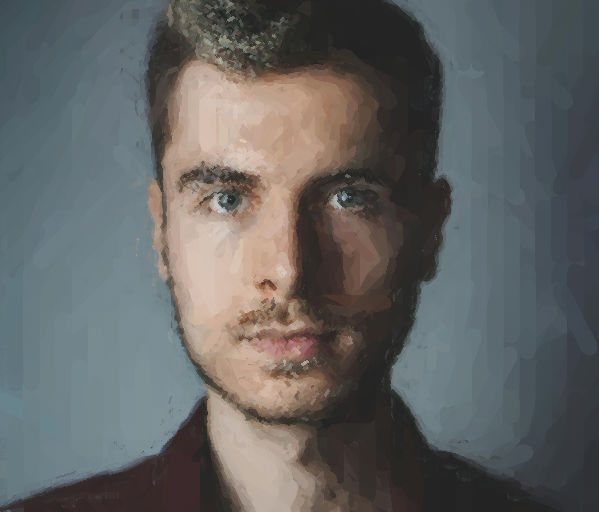
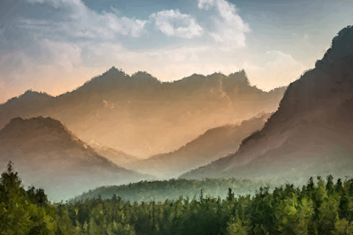
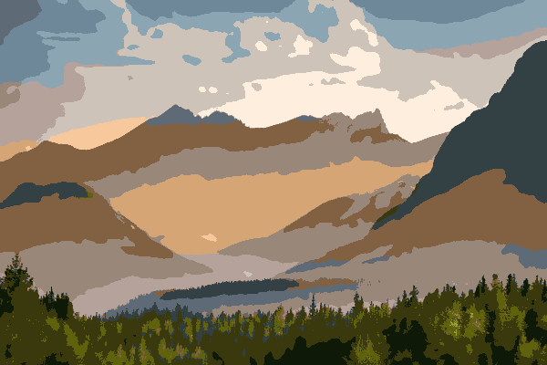
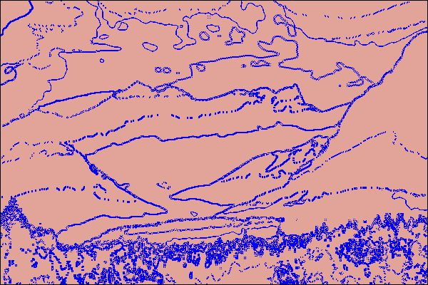

# Painting Filter
#### Non-PhotoRealistic rendering of images in a painted style

Made by Daniel Zajac and Heisn Nithysingha

### About This Project

This project uses several computational photography techniques including sobel filtering, bilateral filtering and brushstroke generation to take source images and render a 'painted' version of them. Below are the steps this algorithm takes to produce the resulting image, as well as a description of the parameters which the user can modify to alter the resulting image as they please.

### Algorithm
The most important part of this filter is the way that it draws large brushstrokes in areas of low detail and smaller more precise brushstrokes in areas of higher detail. Here is a breakdown of how this works:

* First we start with a large radius, R1. During this iteration we want to capture details which are of size R1 or larger. First we use a bilateral filter with radius R1 to blur the image while preserving edges. Next we use sobel filters to calculate gradient directions at each pixel. Then we iterate through the image with step size R1, and at each pixel we plan a brushstroke with width R1 in the direction perpindicular to the gradient. We say 'plan' a brushstroke because we don't draw any brushstrokes until we finish iterating over the whole image, at which point we randomize the order in which brushstrokes are drawn, to remove regular patterns or artifacts. This step provides a rough outline for the painting, however areas of low detail may already be well captured by some brushstrokes at this point.
* On the next iteration over the image, we have to change the way we draw brushstrokes. Similar to the first iteration, we use a bilateral filter with a new radius R2, find gradients with a sobel filter on this blurred image, and begin iterating over the image with step size R2. This time however, we are discriminitive about whether or not we draw a brushstroke at each pixel we iterate over. We define error as the euclidean distance between two colors; the color of the pixel on our current image (which is being painted), and the color of the same pixel on the source image. For each pixel we iterate over, we create a patch of length and height R2, and find the error at each pixel. Then we check if the average error is above some threshold, and if it is, we plan a brushstroke. At this point, we could choose any pixel in the patch to plan the brushstroke at, so we choose to plan it at the pixel in the patch which has the highest error. This way, it is as though we are 'correcting' our painted image at each iteration. Like the first iteration, once we have planned all of the brushstrokes, we randomize the order in which we draw them. It's important to note that this strategy maintains larger brushstrokes in areas of low detail, since the error of those patches will be low, and the larger brushstrokes will stay on the canvas. 

### Parameters
We include several parameters in this project to give the user ample control over the style of the output image. The parameters and their descriptions area as follows:

#### Allowed Error
This is perhaps the most impactful parameter to change, since it directly controls whether or not to draw brushstrokes. Low allowed error means that the painted image will more closely resemble the source image, and therefore have many smaller brushstrokes. Higher allowed error will preserve larger brushstrokes, giving a more painted effect, however increasing this parameter too much will limit the impact of the 'self-correcting' process at each iteration, allowing the painted image to stray further from the source.

#### Brushstroke opacity
This controls the opacity of brushstrokes on iterations after the first. Higher values tend to have a more 'painted' look, whereas lower values look more blended and therefore smoother.

#### Minimum Line Length and Maximum Line Length
Each brushstroke drawn will have a length randomized between the minimum line length * brush radius and the maximum line length * brush radius.

### Some Examples

*Source Image*

*Painted Filter*

*Source Image*

*Painted Filter*

### Unused Ideas
Below are some ideas which did not find a place in this project, but may have some potential in other non-photorealistic rendering approaches.

#### Color palette limiting

*Color segmented Image*

One way to effectively break an image into segments is to find n colors in the image which are the furthest apart from each other via euclidean distance (where n can be an editable parameter). First we apply a bilateral filter to reduce noise and preserve edges. Then, we find the closest color to each pixel from the list of colors in our color palette (of n furthest colors). this helps generate cleaner lines than most denoising techniques if we use sobel filters on the segmented image:

*Edges from Color Segmentation*

This technique does create some 'false edges', which occur when an image has smooth color transitions, during which at some point the colors of those pixel becomes closer to another color in the palette, but these can easily be removed by iterating over the edges and removing them if the gradient magnitude of the original image is small. 

Once we have cleaner edges, we can use line approximation to connect all the edges and then we can successfully distinguish between different 'sections' of the image. We could then potentially treat each section differently based on some statistics of that section, such as different brush sizes, textures etc.